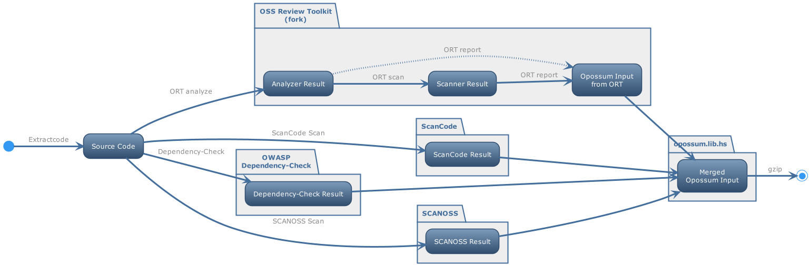

<!--
SPDX-FileCopyrightText: TNG Technology Consulting GmbH <https://www.tngtech.com>

SPDX-License-Identifier: Apache-2.0
-->

# aioc - all in one container

... needs a better name

## What it does



## How to run:

Build the docker image (once):
``` sh
$ ./build-docker-image.sh
```

Scan the root of a project (fo ORT, it must be under vcs):
``` sh
$ ./run-on-folder.sh path/to/project/root
```
this generates a folder `path/to/project/root_aioc` containing the file `merged-opossum.input.json.gz`.

